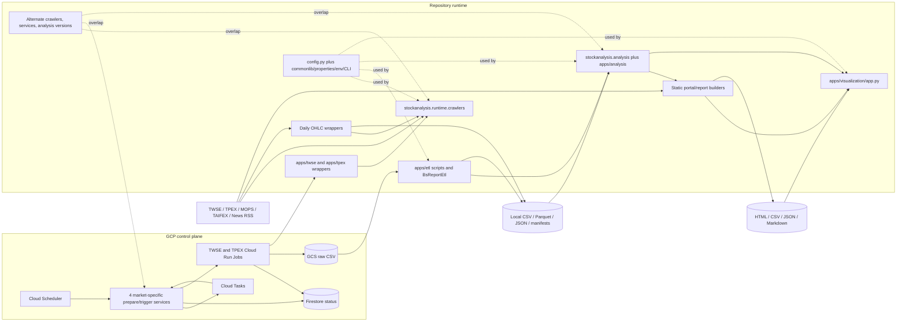
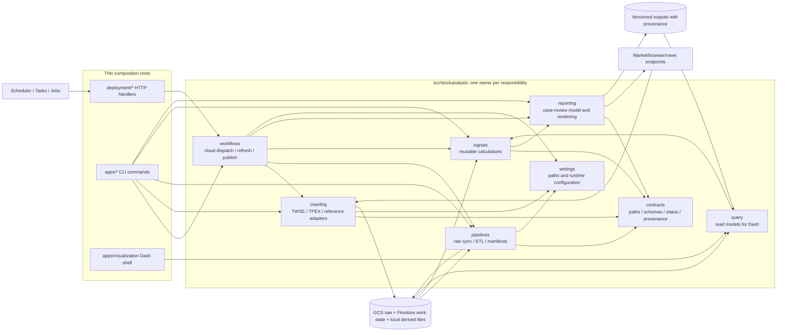

# StockAnalysis Architecture Blueprint

This blueprint evaluates the repository as observed on 2026-08-14. It uses the
codebase inventory under `docs/codebase/`, `docs/runtime-workflow-map.md`, actual
source/imports, deployment configuration, local artifacts, and the read-only
runtime evidence recorded in those documents.

It describes current behavior, not historical intent. The target model is a
cleanup direction, not an assertion that the existing layout was deliberately
designed this way.

## Executive summary

StockAnalysis is a Python 3.11 data-workflow repository with five meaningful
runtime areas: cloud broker-report crawling, local market-data refresh, ETL,
signal/report generation, and a local Dash application. Its useful reusable
logic is increasingly under `src/stockanalysis`, but runtime composition,
research code, old implementations, and deployable services remain spread
across `apps/`, `deployment/`, `scripts/`, and `legacy/`.

The current architecture works primarily through implicit file and cloud-state
contracts. It has no single application boundary and does not need one. Its
main architectural liabilities are duplicated implementations, mixed entry
point and business logic, inconsistent cloud trigger semantics, weak data
freshness/provenance guarantees, and unclear ownership of operator-invoked
research scripts.

The recommended target remains a small modular batch system:

- retain separate TWSE and TPEX jobs because their resource and anti-bot
  behavior genuinely differ;
- make `src/stockanalysis` the only owner of reusable crawling, pipeline,
  signal, and reporting behavior;
- keep `apps/` and `deployment/` as thin composition roots;
- define a few explicit file/status contracts and one downstream refresh
  command;
- consolidate or delete alternate implementations after runtime equivalence is
  proven;
- avoid repository layers, dependency-injection frameworks, event buses, and
  service proliferation.

## Evidence and confidence

| Evidence | What it establishes | Confidence |
|---|---|---|
| Live GCP configuration and logs captured in `docs/runtime-workflow-map.md` | Deployed Scheduler, services, jobs, recent TWSE success, and TPEX timeout behavior | High for the inspected 2026-08-14 state |
| Dockerfiles, entrypoints, deployment handlers, and shell deployment script | Runtime entry chains and cloud boundaries | High |
| Imports and subprocess calls | In-repository dependency direction and direct callers | High |
| Current local Parquet/CSV/JSON/HTML and manifests | Local producer/consumer paths and freshness mismatch | Medium-high |
| README/runbooks | Operator expectations | Medium; documentation may be stale |
| Files with no callers | Possible non-use | Low by itself because humans may invoke scripts directly |

Unknowns requiring owner confirmation are listed at the end. In particular,
absence of a caller is not enough to delete a research CLI.

# 1. Current architecture

## Current system model



The `PREP` node contains four distinct deployable source directories: prepare
and trigger services for each market. The repeated node-to-node path reflects
the actual prepare-to-task-to-trigger chain, not an internal service loop.

## Major modules and actual ownership

| Area | Current owner(s) | Runtime status | Architectural observation |
|---|---|---|---|
| Shared paths/config | `src/stockanalysis/config.py`; legacy `commonlib.py` and `conf/default.properties` | ACTIVE | Newer paths are centralized, but environment variables, CLI flags, properties, and deployment env remain independent contracts. |
| Broker-report crawling | `src/stockanalysis/runtime/crawlers/`, wrappers and images in `apps/{twse,tpex}` | ACTIVE | Current Docker paths delegate to package modules, but three additional TPEX implementations and an older TWSE implementation overlap them. |
| Other market crawling | `apps/crawlers/` and daily-OHLC runtime modules | ACTIVE to UNCERTAIN | Mixed old class/script style and newer package modules; ownership is organized by history more than one stable boundary. |
| Cloud dispatch | Four directories under `deployment/`; provisioning in `scripts/deploy_gcp_environment.sh` | ACTIVE | HTTP handling, work-state changes, batching, and Run Job invocation are repeated per market. |
| Broker-report ETL | `apps/etl/run_bs_report_etl.py` and `apps/etl/bs_report_pipeline.py` | ACTIVE | A coherent local pipeline exists, but it is still app-owned and its success manifest can hide per-file failures. |
| OHLC ETL | `apps/etl/build_ohlc_parquet.py` | ACTIVE | Produces a shared derived file consumed by analysis and UI. Its schema is a convention rather than a checked contract. |
| Stable signal logic | `src/stockanalysis/analysis/` | ACTIVE / LIKELY ACTIVE | Best-defined reusable boundary; dataclass configuration and unit tests exist. Analysis modules also depend directly on concrete file layout. |
| Analysis orchestration/research | `apps/analysis/` | Mixed | Stable refresh/report commands, experimental searches, backtests, and versioned implementations share one folder. Script-to-script imports create a second informal library. |
| Static reporting | Primarily `build_trigger_days_gt5_case_review.py` and other builders in `apps/analysis/` | ACTIVE / UNCERTAIN | Report assembly, scoring, I/O, news fetch, and rendering are combined; main builder is 1,599 lines. |
| Interactive UI | `apps/visualization/app.py` | LIKELY ACTIVE | One 1,798-line composition root also owns loaders, transformations, caching, domain rules, callbacks, and rendering. |
| Historical/alternate code | `legacy/`, `apps/services/`, old crawlers, versioned analyses | ORPHANED / DUPLICATED / UNCERTAIN | Directory name alone is not the lifecycle policy; some old paths remain referenced by scripts. |

## Observed dependency directions

The strongest current dependency direction is:

```text
deployment handlers / apps scripts
    -> stockanalysis.config
    -> stockanalysis.runtime.crawlers or stockanalysis.analysis
    -> pandas/files or external/cloud SDKs
```

This is healthy where wrappers are thin. It is weakened by these observed
exceptions:

- `apps/analysis` modules import other `apps.analysis` scripts. `apps/` is
  therefore both an entrypoint area and an undeclared reusable library.
- analysis modules import concrete path resolution and load data directly, so
  calculation and storage layout are not consistently separable.
- deployment handlers contain orchestration and cloud state transitions rather
  than delegating to shared tested functions.
- `commonlib.py` keeps older crawlers and analyses coupled to the properties
  file and general-purpose helpers.
- there is no automated rule preventing `src/`, `apps/`, and deployment
  responsibilities from drifting back together.

No inspected `src/stockanalysis` module imports from `apps/` or `deployment/`.
That one-way boundary is worth preserving.

## Runtime boundaries

| Boundary | Input | Output / side effect | Failure boundary |
|---|---|---|---|
| Scheduler to prepare service | Authenticated weekday HTTP request | Firestore records and Cloud Tasks | HTTP response and prepare retry logic |
| Cloud Task to trigger service | JSON symbols/date payload | Firestore `running`; Cloud Run execution | HTTP deadline, Cloud Run API, payload parsing |
| Cloud Run crawler job | Args/env, browser/model/proxy assets | Market HTTP/browser traffic, GCS objects, Firestore updates | Container timeout/retry; upstream anti-bot behavior |
| GCS to local ETL | Date folders of raw CSV | Inbox/archive/manifests and per-symbol Parquet | Subprocess/storage/file parsing; current partial-success ambiguity |
| Local files to analysis | Broker Parquet, OHLC, lookup CSV/JSON | Signal Parquet/CSV/JSON | Missing/schema-invalid input generally terminates command |
| Analysis to portal | Three independently refreshed result sets | HTML/detail pages plus CSV/JSON/Markdown and optional news cache | Subprocess and per-news fallback; no prerequisite freshness gate |
| Local artifacts to Dash | OHLC, broker and signal outputs | Debug web server, plots/tables, process caches | Some loaders degrade to empty frames; critical OHLC can fail startup/callback |

The Cloud Run service, Cloud Task, Cloud Run Job, local process, and browser are
real runtime boundaries. Most Python folders are organizational boundaries only
and are not independently deployed services.

## Persistence and data contracts

| Store | Current role | Contract shape | Main issue |
|---|---|---|---|
| GCS | Durable raw broker-report CSV | Bucket/folder/object naming conventions | Bucket and source provenance are not uniformly recorded downstream. |
| Firestore | Crawl work coordination | Collection paths and string statuses shared by prepare, trigger, and crawler | Success commonly deletes state, limiting auditability; state values are implicit. |
| Local CSV | Raw/reference/compatibility data | Filename and column conventions | Schema and encoding drift are detected late. |
| Local Parquet | Derived OHLC, per-symbol broker data, signals | pandas columns and directory layout | No versioned schema or producer metadata. |
| JSON/manifests | ETL skip state, report data, news cache | Script-specific dictionaries | Manifest success does not always prove complete processing. |
| HTML/Markdown/images | Human-facing generated results | Builder-specific output trees | Fresh-looking output may combine prerequisites from different dates. |
| Model/assets | TWSE captcha and report assets | Expected image paths | Docker copy/runtime path must match code convention. |

There is no SQL database, ORM, repository pattern, or transaction boundary.
Adding those would not address the actual file-contract problems.

## External integrations

- Market/public data: TWSE, TPEX, MOPS, TAIFEX, and TWSE ISIN endpoints.
- Browser/anti-bot: Chrome/Chromium, Xvfb, TWSE captcha model, TPEX
  Turnstile/browser automation, and optional proxy URLs.
- GCP: Scheduler, Cloud Run services, Cloud Tasks, Cloud Run Jobs, Firestore,
  GCS, Cloud Build, Artifact Registry, IAM/OIDC, and Secret Manager in the live
  TPEX job configuration.
- Enrichment/UI: Google News RSS, Yahoo Finance links, Dash, Plotly, and a local
  browser.

External behavior is embedded directly in handlers, crawlers, ETL commands, or
report builders. There are few narrow seams for deterministic integration
tests.

## Cross-cutting concerns

| Concern | Current implementation | Consequence |
|---|---|---|
| Configuration | `config.py`, environment variables, CLI flags, deployment variables, `commonlib.py`, properties | Operators must know which configuration authority applies to each entrypoint. |
| Logging | Standard `logging` in current paths plus `print` in older/research scripts | Log shape, context, and redaction are inconsistent. |
| Retry/timeout | Local loops in each service/crawler; Cloud Tasks and Jobs also retry | Combined retry duration and duplicate work are difficult to reason about. |
| Errors/status | Exceptions, HTTP status responses, empty DataFrames, log-and-skip, and Firestore strings | “No data,” partial success, transient failure, and terminal failure are not uniformly distinguishable. |
| Security | ADC/OIDC/IAM, proxy secrets, some `verify=False`, broad provisioning roles | Credential plumbing exists, but TLS and least-privilege behavior require explicit remediation. |
| Observability | Cloud logs and local logs; no traced workflow ID, metrics, alerts, or SLOs found | Cross-boundary diagnosis is manual. |
| Testing | 27 analysis-focused unit tests passed; no dedicated crawler/cloud/ETL/report E2E suite | Core transformations have a base, but integration contracts can regress unnoticed. |
| Dependencies | Root `uv` lock plus ETL, image, and service manifests | Different runtimes can resolve different library versions. |

## Duplication and inconsistent patterns

### Confirmed duplicated responsibilities

- TPEX broker crawling exists in `tpex_local_runner.py`,
  `tpex_bs_report.py`, `tpex_bs_report_new.py`, and
  `apps/crawlers/Crawler_TPEXBuySellReport.py`. Only the local-runner path is in
  the current container entry chain.
- TWSE broker crawling exists in the current thin-wrapper/package path and an
  older full `crawler-twse-bsreport.py`; `scripts/twse.sh` still targets the
  older path.
- Cloud prepare/trigger responsibilities exist in active `deployment/`, older
  `apps/services/`, and four `legacy/apps` service trees.
- `Analysis_BsReport_v1.py` through `v4.py` preserve overlapping generations of
  research behavior; v4 is documented as the baseline but older modules still
  have research references.

### Inconsistent architectural patterns

- Some app files are thin wrappers; others are the full implementation.
- Some reusable logic lives in `src`; some is imported from `apps.analysis`.
- Some stages expose dataclass configuration; others combine global constants,
  CLI parsing, environment reads, and direct I/O.
- TWSE trigger returns after starting a job; TPEX trigger waits synchronously
  for job completion despite the trigger service's shorter timeout.
- Optional input failures may become empty data in the UI, while analysis CLIs
  usually fail; ETL can log per-file failure and still mark a date successful.
- Modern snake-case modules coexist with PascalCase and numbered version files,
  without a lifecycle registry explaining support status.

## Inappropriate coupling

1. The case-review portal is coupled to three independently generated output
   trees but only one upstream refresh script invokes it. It can publish a
   mixed-date view without detecting stale prerequisites.
2. Dash callbacks are coupled directly to file discovery, schemas, domain
   calculations, and process-global caches, making UI changes and data changes
   difficult to test separately.
3. Cloud service handlers are coupled to Firestore path/status details and Run
   Job payload construction, duplicating coordination policy across markets.
4. Analysis modules and scripts are coupled to concrete directory layout through
   shared path resolution rather than accepting explicit input tables/paths at
   all useful seams.
5. Crawler completion and work-state deletion are coupled; deleting status on
   success removes operational history needed to distinguish completion from
   missing work.
6. Runtime dependency selection is coupled to the packaging surface that starts
   the component, so local, Docker, and buildpack executions can differ.

## Unclear ownership

- Which `apps/analysis/run_*` commands are supported workflows versus disposable
  experiments is not recorded.
- Debug TPEX images and alternate browser implementations may still be used
  manually, but no owner or support promise is present.
- `scripts/twse.sh` conflicts with the current Docker entry path.
- No source-of-truth document owns file schemas, status transitions, container
  argument formats, or output freshness.
- It is unclear whether the repository-local data tree, an external local data
  root, or GCS is authoritative for each dataset after raw ingestion.

# 2. Recommended target architecture

## Target principles

1. Model the repository as a collection of explicit workflows, not a monolith.
2. Give each reusable responsibility one package owner and one supported
   implementation.
3. Keep executable and cloud boundaries thin; put behavior behind ordinary
   Python functions that can be tested without starting a process or calling
   GCP.
4. Pass explicit paths/data/configuration at workflow seams; do not introduce a
   dependency-injection framework.
5. Keep GCS, Firestore, and files. Strengthen their contracts before considering
   different storage technology.
6. Retain separate market adapters where TWSE and TPEX genuinely differ.
7. Prefer deleting superseded code and consolidating scripts over adding
   compatibility layers.

## Target system model



The boxes are Python module ownership boundaries, not proposed microservices.
They may begin as a handful of modules. `contracts` means small schema/status
definitions and validation functions, not a generic repository layer.

## Target module ownership

| Target area | Owns | Does not own |
|---|---|---|
| `stockanalysis.settings` | Path/env parsing and validated runtime settings | Business thresholds or GCP calls |
| `stockanalysis.contracts` | Dataset columns/types, artifact metadata, crawl statuses, job argument parsing | Storage framework or generic serialization abstraction |
| `stockanalysis.crawling` | One supported adapter per market/data product; browser/HTTP parsing | Scheduling, report rendering, or exploratory strategies |
| `stockanalysis.pipelines` | GCS sync, CSV normalization, Parquet construction, complete manifests | Signal selection and UI callbacks |
| `stockanalysis.signals` | Reusable DataFrame/domain calculations and their configuration | CLI parsing, file discovery, news, HTML |
| `stockanalysis.reporting` | Case-review composition, freshness validation, static rendering, optional enrichment | Signal recomputation hidden inside rendering |
| `stockanalysis.query` | Read-only loading/aggregation shaped for Dash | Dash layout/callback declarations |
| `stockanalysis.workflows` | Explicit sequencing, run IDs, stage outcomes, cloud dispatch behavior | Market parsing or generic workflow engine |
| `apps/` | Argument parsing, dependency construction, exit code, Dash layout/callback shell | Reusable calculations or alternate implementations |
| `deployment/` | Framework-specific request/response wrappers and deploy manifests | Duplicated market coordination policy |
| `research/` or clearly named `apps/experiments/` | Owner-marked, non-production experiments with inputs/outputs documented | Production-supported commands |

This naming is directional. Migration should move behavior only when a concrete
testable seam exists; it should not create empty packages in advance.

## Target dependency rules

```text
apps and deployment
    -> workflows or a focused package module
        -> crawling / pipelines / signals / reporting / query
            -> contracts and settings
                -> standard library and concrete external libraries
```

- Package modules never import `apps`, `deployment`, or research scripts.
- Signals do not import crawlers, cloud SDKs, Dash, or report renderers.
- Reporting consumes declared signal artifacts; it does not silently choose
  whichever files happen to exist.
- Query modules may reuse signal calculations but remain read-only.
- Market-specific code shares only proven common helpers. TWSE and TPEX are not
  forced behind a broad abstract interface.

## Target runtime behavior

### Cloud crawl

Keep the deployed resource separation initially, but have the four handlers
delegate to shared functions. Both trigger handlers validate the same explicit
payload and return an operation/run identifier immediately. TWSE and TPEX jobs
remain separate and retain different CPU, memory, timeout, browser, model, and
proxy configuration.

Each execution receives a bounded symbol batch and a date. It writes statuses
`pending`, `running`, `succeeded`, or `failed` with run ID, attempt, timestamps,
image revision, and error summary. Terminal records are retained for a defined
short period instead of being immediately deleted.

### Local data refresh and ETL

A supported refresh command sequences only explicit stages:

```text
sync raw -> validate raw set -> build broker Parquet -> build OHLC Parquet
         -> write complete manifest with counts and source identity
```

A folder succeeds only when every intended file is either processed or recorded
with an explicit accepted disposition. Partial processing is a failed/partial
state, never normal success.

### Signals and reports

A supported publish command runs or verifies all prerequisites:

```text
persistent accumulation
  + general flow anomaly
  + broker branch accumulation
  -> verify common data horizon and source fingerprints
  -> build case-review portal
```

Individual signal commands remain available for research and diagnosis, but
the production-facing portal command refuses mixed or unknown freshness unless
the operator explicitly chooses a diagnostic override.

### Dash

The Dash file retains application creation, layout, and callbacks. File loading,
normalization, and case derivation move behind a small read-model module. That
module accepts paths and returns DataFrames/plain values, so it can be tested
without a Dash server. No separate web API is needed.

## Recommended changes

### A. Establish one supported crawler implementation per market

**CURRENT**
The deployed/current path uses `twse_bs_report.py` and
`tpex_local_runner.py`, while older and experimental implementations overlap
them. Local scripts still reference at least one older TWSE path.

**TARGET**
Name one production crawler per market/data product. Preserve minimal token or
browser diagnostics as explicitly named diagnostic commands; delete the other
implementations and update launchers only after equivalence and operator-use
checks.

**WHY**
A bug fix, proxy change, or parsing change should have one obvious destination.
Deletion reduces more complexity than a new common crawler abstraction would.

**MIGRATION RISK: High**
The deployed TPEX image is older than the checkout and manual debug paths may
be operationally important. Record image-to-commit provenance, compare behavior,
and identify human-invoked commands before deleting anything.

### B. Make deployable handlers thin while retaining market-specific resources

**CURRENT**
Four deployment directories repeat validation, Firestore transitions, task
batching, and Run Job invocation. TWSE returns asynchronously; TPEX waits for
completion despite a five-minute service timeout.

**TARGET**
Keep four thin deployable wrappers at first, backed by shared prepare and trigger
functions in `stockanalysis.workflows`. Both triggers start a job and return its
operation ID. Market differences are explicit configuration, not copied control
flow.

**WHY**
This fixes divergence without merging resources that have different scaling,
timeouts, dependencies, and failure modes.

**MIGRATION RISK: High**
Changing acknowledgement timing affects Cloud Tasks retries and Firestore
semantics. Add handler contract tests and deploy one market at a time.

### C. Define and validate the cloud job payload/status contract

**CURRENT**
Symbols, dates, batch size, collection paths, and status strings are implicit
across Scheduler, Tasks, services, and containers. Successful crawlers delete
Firestore work records.

**TARGET**
Use one small payload parser and status definition. Require date, non-empty
bounded symbols, run ID, and market. Retain terminal status with timestamps,
attempt, image revision, counts, and a short error; apply an operational
retention policy.

**WHY**
Explicit contracts prevent argument-splitting and oversized-job mistakes and
make failures auditable without introducing a new database.

**MIGRATION RISK: Medium-high**
Old queued tasks and existing Firestore documents may not match the new shape.
Version the payload and allow a bounded compatibility window.

### D. Move ETL ownership into the package and correct completion semantics

**CURRENT**
The current ETL is mostly coherent but lives under `apps/etl`. A date folder can
be logged with individual CSV failures and still be manifested/archived as
successful.

**TARGET**
Keep the CLI thin and move tested sync/transform/manifest functions to
`stockanalysis.pipelines`. A manifest records expected, processed, skipped, and
failed files plus source identity; success requires zero unaccepted failures.

**WHY**
Manifest correctness is a data-integrity boundary. Packaging the behavior makes
it testable without invoking a subprocess while retaining simple files.

**MIGRATION RISK: Medium**
Stricter semantics will surface folders previously treated as complete and may
require reprocessing. Build reconciliation/report-only mode before changing
archive behavior.

### E. Add minimal explicit dataset contracts and provenance

**CURRENT**
Paths, columns, encodings, date formats, and output filenames are producer/
consumer conventions. Generated outputs do not uniformly state their source
horizon or producer revision.

**TARGET**
For each high-value dataset, define required columns/types, path builder, and a
sidecar manifest containing schema version, source dates/fingerprints, producer,
revision, record count, and created time. Validate at workflow boundaries.

**WHY**
This directly addresses late schema and freshness failures. A few constants and
validation functions are sufficient; a schema registry service is unnecessary.

**MIGRATION RISK: Medium**
Historic files lack metadata and some schemas may legitimately vary. Start with
new outputs and compatibility readers; do not rewrite the full archive first.

### F. Provide one explicit downstream refresh/publish workflow

**CURRENT**
ETL and three signal families are independently invoked. The broker-branch
refresh calls the portal builder, but does not refresh or verify the other two
portal prerequisites. Current artifacts have demonstrated mixed dates.

**TARGET**
Add one ordinary Python workflow function and thin CLI that runs selected
stages, records each outcome, verifies a common horizon/provenance, and then
publishes. Keep individual stage CLIs.

**WHY**
Humans and coding agents get one trustworthy happy path without a workflow
engine. Explicit stage calls make failure and rerun behavior understandable.

**MIGRATION RISK: Medium**
Some signals may intentionally use different windows. Define freshness as an
explicit per-artifact rule and support dry-run/verify-only before enforcing it.

### G. Separate stable signal logic from research orchestration

**CURRENT**
`src/stockanalysis/analysis` contains tested reusable calculations, while
`apps/analysis` mixes supported refresh/report commands with experiments and
also acts as an importable library.

**TARGET**
Move only reused, tested logic into `stockanalysis.signals` or
`stockanalysis.reporting`. Keep supported commands in `apps/analysis`; move
confirmed experiments to a clearly labelled area with owner/status metadata,
and delete confirmed obsolete versions.

**WHY**
This makes support status and dependency direction visible while preserving the
repository's research function.

**MIGRATION RISK: Medium-high**
Human invocation is not visible in imports. Inventory commands, output artifacts,
and owners before reclassification; initially move or delete only confirmed
cases.

### H. Split Dash data/query behavior from Dash rendering

**CURRENT**
`apps/visualization/app.py` combines file discovery, transforms, domain rules,
caches, layout, callbacks, and rendering in 1,798 lines.

**TARGET**
Extract a small `stockanalysis.query` module for path-parameterized loaders and
read-model calculations. Leave layout and callbacks in the app and keep the
existing local Dash deployment model.

**WHY**
Data behavior becomes testable and reusable without adding an API service or a
front-end rewrite.

**MIGRATION RISK: Medium**
Module globals and callback state can conceal behavior. Add characterization
tests with representative files and extract one loader/callback path at a time.

### I. Consolidate configuration without creating a settings framework

**CURRENT**
Paths are centralized for newer code, but legacy properties, environment reads,
CLI defaults, deployment env, and hardcoded runtime values coexist. Dependency
manifests also vary by execution surface.

**TARGET**
Use small validated settings dataclasses/functions per runtime, built from env
and CLI exactly once at the entrypoint. Document an environment/dependency
matrix. Retire `commonlib` configuration access as its callers are migrated.

**WHY**
Configuration authority becomes explicit, errors fail early, and tests can pass
values directly. A third-party settings/DI container is not needed.

**MIGRATION RISK: Medium**
Changing defaults can redirect real data or cloud resources. Preserve current
defaults initially, emit resolved configuration safely, and migrate one
entrypoint at a time.

### J. Standardize failure vocabulary, logging context, and retry ownership

**CURRENT**
Components independently use exceptions, empty frames, HTTP responses,
Firestore strings, log-and-skip, and nested retry policies. Logs do not share a
workflow/run identifier.

**TARGET**
Define a small vocabulary: success, partial, retryable failure, terminal failure,
and no data. Give each boundary one retry owner, and include run ID, market,
date, symbol/batch, attempt, and image revision in structured log fields.

**WHY**
Operators can distinguish absence from failure and reason about total retry
duration. This requires conventions and helpers, not an observability platform.

**MIGRATION RISK: Medium**
Changing exceptions or status interpretation can affect callers. Start at
workflow boundaries and retain original error detail.

### K. Add contract-focused tests and one bounded smoke path

**CURRENT**
The 27 discovered tests focus on analysis. Deployment handlers, ETL manifests,
file contracts, wrappers, browsers, GCP calls, reports, and Dash read models
lack dedicated automated coverage.

**TARGET**
Add fast tests for payload/status transitions, ETL partial failure, dataset
schemas, freshness checks, and read models. Add container entrypoint/import
smokes and opt-in tiny external smokes: token/single-symbol before full crawler.

**WHY**
Tests should guard the boundaries being consolidated. A broad mocked E2E suite
would be expensive and less trustworthy than focused contracts plus tiny live
checks.

**MIGRATION RISK: Low**
Test fixtures can accidentally codify bad behavior. Derive them from observed
artifacts and state clearly whether each test is characterization or desired
behavior.

### L. Make lifecycle and image provenance explicit, then delete

**CURRENT**
ACTIVE, LIKELY ACTIVE, DUPLICATED, ORPHANED, and UNCERTAIN code coexist. The
live TPEX image tag points to an older commit than the checkout, and runtime
secret configuration does not prove the deployed code consumes it.

**TARGET**
Maintain a short supported-entrypoint registry with owner, classification,
command, image/revision, inputs, and outputs. Embed source revision in images
and manifests. Delete confirmed orphaned/duplicated code rather than retaining
indefinite compatibility copies.

**WHY**
Cleanup becomes evidence-based and agents can choose the correct path without
searching every historical implementation.

**MIGRATION RISK: Low for metadata; High for deletion**
The registry is additive. Deletion must wait for operator-use checks, deployed
revision parity, and a recoverable Git history point.

## Suggested migration sequence

This sequence minimizes simultaneous behavioral change. Each phase should be a
separate reviewed change; none is performed by this document.

| Phase | Scope | Exit evidence |
|---|---|---|
| 0. Baseline | Supported-entrypoint registry, image revision reporting, representative fixtures, current behavior tests | Every production claim maps to a command/image and revision. |
| 1. Correctness boundaries | TPEX async trigger contract, bounded payload validation, ETL partial-success semantics | Handler and ETL contract tests; one bounded TWSE/TPEX validation run. |
| 2. Data trust | Dataset validation, provenance manifests, downstream freshness verification | Portal can prove or reject prerequisite compatibility. |
| 3. Consolidation | Shared deployment workflow functions, one crawler per market, remove confirmed old service/crawler copies | Active images and commands use canonical implementations; no supported reference points to deleted code. |
| 4. Code ownership | Package ETL/report/query seams; thin app/deployment entrypoints | Reusable logic is importable/testable without process, Dash, or GCP startup. |
| 5. Research cleanup | Classify versioned analyses and `run_*` scripts; archive/delete confirmed obsolete paths | Remaining executables have owner/status/input/output records. |

## What not to introduce

- No microservice split for ETL, analysis, reporting, or Dash.
- No SQL database solely to replace working Parquet/CSV workflows.
- No generic repository or DAO layer over files/GCS.
- No dependency-injection container.
- No workflow engine until ordinary explicit Python orchestration proves
  insufficient.
- No forced common crawler base class where TWSE/TPEX mechanics differ.
- No `utils` package that becomes a new home for unrelated ownership.

## Target quality gates

The target can be considered materially reached when:

- every supported runtime entrypoint is listed and maps to one implementation;
- `src/stockanalysis` never imports from `apps`, `deployment`, or research code;
- cloud payload/status, primary file schemas, and artifact provenance are
  validated by tests;
- a portal publication proves compatible prerequisite horizons;
- an ETL manifest cannot report success with unaccounted file failures;
- TWSE and TPEX trigger acknowledgement behavior is explicit and tested;
- Dash data calculations run in tests without starting Dash;
- deployed image revision is visible in logs/status/manifests;
- confirmed duplicate and orphaned implementations are deleted;
- the full target still fits the repository's Python/GCP/file-based stack.

## Human clarification required

1. Which analysis/report commands are production-supported, routinely used
   research, or disposable experiments?
2. Are the alternate TPEX debug images/browser implementations part of an
   operator recovery procedure?
3. Is any CI configured outside this checkout, and which checks gate deployment?
4. Which storage location is canonical for each stage: GCS, repo-local data, or
   an environment-selected external local directory?
5. How long should successful and failed Firestore crawl records be retained?
6. Are mixed data horizons ever intentional for the case-review portal, and if
   so what compatibility rule should replace exact-date equality?
7. Which entity owns proxy-secret rotation and image deployment verification?

## Source index

- `docs/codebase/STACK.md`
- `docs/codebase/STRUCTURE.md`
- `docs/codebase/ARCHITECTURE.md`
- `docs/codebase/CONVENTIONS.md`
- `docs/codebase/INTEGRATIONS.md`
- `docs/codebase/TESTING.md`
- `docs/codebase/CONCERNS.md`
- `docs/runtime-workflow-map.md`
- `src/stockanalysis/config.py`
- `src/stockanalysis/runtime/crawlers/`
- `src/stockanalysis/analysis/`
- `apps/etl/`
- `apps/analysis/`
- `apps/visualization/app.py`
- `deployment/`
- `scripts/deploy_gcp_environment.sh`
