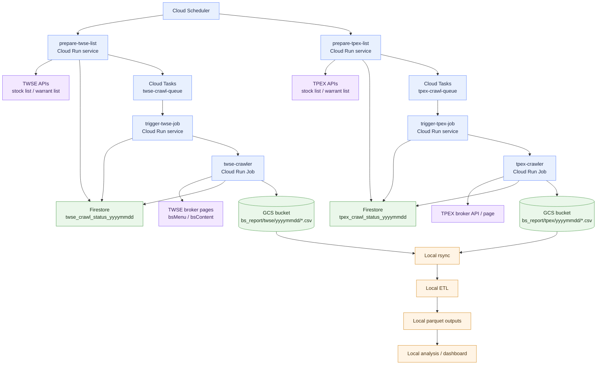
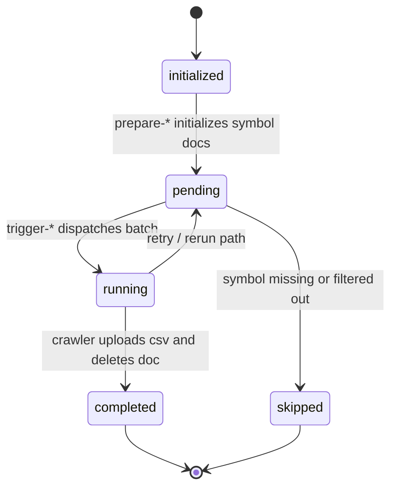

# GCP Architecture

This diagram summarizes the current production flow deployed on GCP.



## Notes

- `deployment/` is the primary source of the production GCP services.
- Firestore is used as the per-day crawl status store for symbol batches.
- GCS is the handoff point between GCP crawlers and local ETL / analysis.

## Firestore Status Flow



## Local Data Flow

```mermaid
flowchart LR
    gcs[(GCS bucket<br/>bs_report/twse|tpex/yyyyMMdd/*.csv)]
    rsync[gcloud storage rsync]
    rawBs[Local raw bs_report folders<br/>data/bs_report/twse|tpex/yyyyMMdd]
    etl[ETL scripts<br/>apps/etl]
    brokerParquet[(Broker parquet<br/>data/bs_report/parquet_twse|parquet_tpex)]

    ohlcCsv[Local OHLC CSV<br/>data/ohlc/twse-yyyymmdd.csv<br/>data/ohlc/tpex-yyyymmdd.csv]
    brokerList[Broker list CSV<br/>data/broker_list.csv]

    analysis[Analysis scripts<br/>apps/analysis and src/stockanalysis/analysis]
    derived[(Derived datasets<br/>data/_derived/ohlc.parquet<br/>data/_derived/scored.parquet<br/>other derived outputs)]
    reports[Outputs<br/>HTML / PNG / CSV]
    viz[Dash visualization<br/>apps/visualization/app.py]

    gcs --> rsync
    rsync --> rawBs
    rawBs --> etl
    etl --> brokerParquet

    brokerParquet --> analysis
    ohlcCsv --> analysis
    analysis --> derived
    analysis --> reports

    brokerParquet --> viz
    derived --> viz
    ohlcCsv --> viz
    brokerList --> viz
```
