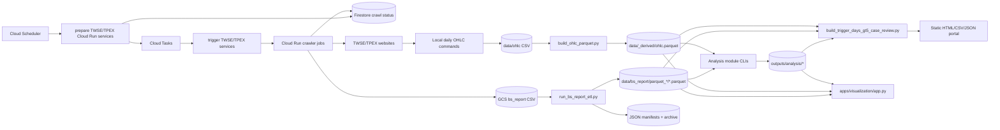

# StockAnalysis Runtime Workflow Map

Generated from repository source, runtime configuration, local artifacts, git references, and read-only GCP inspection on 2026-08-14. This document describes observed behavior. It does not reconstruct design intent.

## Classification and evidence rules

Runtime classification:

- **ACTIVE**: participates in a currently deployed path, a recently observed execution, or a locally materialized workflow with direct caller/output evidence.
- **LIKELY ACTIVE**: referenced by an active path or current operator documentation, but not directly observed executing.
- **ORPHANED**: no meaningful caller, deployment, wrapper, operator command, or current output consumer was found.
- **DUPLICATED**: overlaps another implementation that currently owns the same responsibility. A file can be both duplicated and diagnostic/uncertain in use.
- **UNCERTAIN**: executable or consumable in isolation, but repository and runtime evidence do not establish current use.

Evidence strength:

1. **Live verified**: current GCP specification, execution, or log inspected read-only.
2. **Artifact verified**: current local output or manifest exists and identifies a producer/consumer contract.
3. **Repo confirmed**: Dockerfile, deployment script, wrapper, import, subprocess call, or explicit operator command establishes the path.
4. **Static only**: standalone code or documentation exists without observed execution.

An `ACTIVE` label does not mean healthy. The current TPEX cloud path is active and producing objects, but its latest observed execution failed by timeout.

## Runtime system map



There is no single end-to-end orchestrator spanning GCS through ETL, analysis, portal generation, and Dash. Those downstream stages are separate commands connected by files.

## Workflow 1 — Scheduled TWSE broker buy/sell crawl

**Classification:** ACTIVE  
**Evidence:** live verified on 2026-08-14; the latest inspected execution `twse-crawler-c9cjh` completed successfully on 2026-08-13 and logged 2,339 successfully crawled symbols.

### Runtime path

```text
Cloud Scheduler prepare-twse-crawler
  -> deployment/prepare-twse-list/main.py:main(request)
  -> Firestore twse_crawl_status_YYYYMMDD
  -> Cloud Tasks twse-crawl-queue
  -> deployment/trigger-twse-job/main.py:trigger_run_job(request)
  -> Cloud Run Job twse-crawler
  -> apps/twse/Dockerfile ENTRYPOINT
  -> apps/twse/crawler-twse-bsreport-new.py
  -> stockanalysis.runtime.crawlers.twse_bs_report
  -> TWSE broker-report HTTP/captcha flow
  -> GCS bs_report/twse/YYYYMMDD/<symbol>.csv
  -> delete successful Firestore symbol document
```

### Layer trace

| Concern | Actual implementation |
|---|---|
| Runtime entry point | Scheduler `prepare-twse-crawler`, enabled at `0 18 * * 1-5` Asia/Taipei; target is the deployed prepare service. |
| Orchestration | `deployment/prepare-twse-list/main.py` selects symbols and creates batches/tasks. `deployment/trigger-twse-job/main.py` converts each task into a Cloud Run Job override. |
| Business/domain logic | `src/stockanalysis/runtime/crawlers/twse_bs_report.py` solves the TWSE captcha with the bundled model, fetches broker report content, parses rows, and manages symbol retries. |
| Persistence | Firestore is the work/status set. Successful CSVs go to GCS. Temporary captcha and report files live inside the job container. |
| External dependencies | TWSE endpoints, Compute Metadata, Firestore, Cloud Tasks, Cloud Run Jobs API, GCS, TensorFlow/OpenCV. |
| Side effects | Creates/updates/deletes Firestore documents; creates Cloud Tasks; starts Cloud Run executions; uploads GCS objects; writes local temporary files; may start bounded rerun jobs. |
| Error handling | Prepare HTTP calls retry three times. Trigger validates JSON and returns 4xx/5xx. Crawler uses per-symbol queues/retries, handles “no data,” retries 403/content failures, and can request a bounded Cloud Run rerun. |
| Configuration | `QUEUE_NAME`, `FUNCTION_URL`, `LOCATION`, `JOB_NAME`, `STOCK_CRAWLER_BUCKET`, region/job rerun variables, retry variables; Docker copies `assets/models/twse_cnn_model.hdf5`. |

### Observed runtime details

- Deployed job image: `.../my-repo/twse-crawler:20260601-1`.
- Job resources: 2 CPU, 6 GiB, one task, parallelism one, 36,000-second timeout, one platform retry.
- Latest inspected successful run uploaded each symbol to GCS and deleted its Firestore document.
- The deployed image tag does not identify a git commit. Its exact source parity with the current checkout is **UNCERTAIN**, even though the observed log behavior matches `twse_bs_report.py`.

## Workflow 2 — Scheduled TPEX broker buy/sell crawl

**Classification:** ACTIVE but currently incomplete/failing by timeout  
**Evidence:** live verified. The latest execution `tpex-crawler-9dkkr` processed and uploaded symbols on 2026-08-13, then each task attempt hit the 3,600-second limit. With two platform retries, the execution lasted about three hours and ended failed.

### Runtime path

```text
Cloud Scheduler prepare-tpex-crawler
  -> deployment/prepare-tpex-list/main.py:main(request)
  -> Firestore tpex_crawl_status_YYYYMMDD
  -> Cloud Tasks tpex-crawl-queue
  -> deployment/trigger-tpex-job/main.py:trigger_run_job(request)
  -> Cloud Run Job tpex-crawler
  -> apps/tpex/Dockerfile
  -> apps/tpex/entrypoint.sh (Xvfb)
  -> apps/tpex/crawler-tpex-bsreport.py
  -> stockanalysis.runtime.crawlers.tpex_local_runner
  -> TPEX daily OHLC filter + Chromium/CDP Turnstile + brokerBS POST
  -> GCS bs_report/tpex/YYYYMMDD/<symbol>.csv
  -> delete successful Firestore symbol document
```

### Layer trace

| Concern | Actual implementation |
|---|---|
| Runtime entry point | Scheduler `prepare-tpex-crawler`, enabled at `0 17 * * 1-5` Asia/Taipei. |
| Orchestration | Prepare service loads/fetches TPEX symbols and creates tasks. Trigger service marks symbols running and starts the TPEX job. Unlike TWSE, it calls `response.result()` and waits for the job operation. |
| Business/domain logic | `tpex_local_runner.py` re-fetches daily EW/WW OHLC, filters the supplied batch to traded four-character stocks plus traded call/put warrants, obtains Turnstile tokens through Chromium CDP, posts brokerBS requests, and retries each symbol up to three times. |
| Persistence | Firestore work documents, local container CSVs, and GCS objects. Successful/excluded symbols are removed from Firestore; failures remain. |
| External dependencies | TPEX OHLC and brokerBS endpoints, Chromium/Xvfb/CDP, optional proxy service, Firestore, Cloud Tasks, Cloud Run API, GCS. |
| Side effects | Same cloud side effects as TWSE plus Chromium processes and temporary browser profiles/extensions. |
| Error handling | Argument/date validation; OHLC fetch failure aborts the job; per-symbol Firestore errors continue; empty token/invalid response/upload failures are logged; process returns nonzero if any symbols fail. Platform retries restart the whole job task. |
| Configuration | `STOCK_CRAWLER_BUCKET`, `TPEX_PROXIES`/`PROXY`, `TPEX_LOCAL_OUTPUT_DIR`, `QUEUE_NAME`, `FUNCTION_URL`, `LOCATION`, `JOB_NAME`; job timeout/retries live in Cloud Run configuration. |

### Deployed-code drift and failure behavior

- Deployed image: `.../my-repo/tpex-crawler:20260719-1954cfd`, last job update 2026-07-19.
- Deployed job has `TPEX_PROXIES` wired from Secret Manager secret `tpex-proxies`, but commit `1954cfd` predates the later proxy-rotation change. The latest logs also lack the current source’s `Using proxy ...` messages. Therefore the secret is configured but the observed deployed image is very likely not consuming it.
- The deployed image still runs `tpex_local_runner.py`; it is not the older `tpex_bs_report.py` or `tpex_bs_report_new.py` implementation.
- Latest logs show fast successful token acquisition and uploads, then termination near symbol `2852/5426`. This is a throughput/timeout boundary, not a total inability to crawl.
- Because completed symbols are deleted from Firestore, platform retries can make incremental progress. However, the runner still re-fetches and sorts the full traded universe, and the execution is reported failed when the timeout kills each attempt.
- Both trigger services acknowledge `run_job()` asynchronously with an operation ID. The HTTP response confirms Job start only; crawler completion remains observable through Firestore and Job logs.

## Workflow 3 — Local market-data refresh and ETL

**Classification:** ACTIVE for the file pipeline; live external sync was not rerun during this analysis.  
**Evidence:** repo-confirmed operator commands plus artifact-verified outputs/manifests updated on 2026-08-08.

This is two independently invoked subflows.

### 3A. Daily OHLC refresh

```text
apps/twse/crawler-twse-daily-ohlc.py
  -> stockanalysis.runtime.crawlers.twse_daily_ohlc
  -> data/ohlc/twse-YYYYMMDD.csv

apps/tpex/crawler-tpex-daily-ohlc.py
  -> stockanalysis.runtime.crawlers.tpex_daily_ohlc
  -> data/ohlc/tpex-YYYYMMDD.csv

apps/etl/build_ohlc_parquet.py
  -> normalize market-specific columns
  -> data/_derived/ohlc.parquet
```

| Concern | Actual implementation |
|---|---|
| Runtime entry point | Three independent CLI commands in `docs/data-refresh-runbook.md`. |
| Orchestration | Each daily module loops from the latest/start date to today; `build_ohlc_parquet.py` scans all matching CSVs. There is no code-level command chaining. |
| Business/domain logic | Fetch/parse daily market tables; rename TWSE/TPEX columns into `symbol,date,open,high,low,close,volume,market`. |
| Persistence | Raw daily CSVs and a consolidated Parquet file. |
| External dependencies | TWSE and TPEX HTTP endpoints for the first two commands. |
| Side effects | Writes or overwrites dated CSVs and `_derived/ohlc.parquet`. |
| Error handling | Per-date fetch errors are logged/continued in daily crawlers; Parquet build raises if no usable rows exist. |
| Configuration | Central `STOCKANALYSIS_*` path variables; optional CLI start date/input/output paths. |

### 3B. Broker-report sync and Parquet ETL

```text
apps/etl/run_bs_report_etl.py --market <twse|tpex|all> [--sync]
  -> gcloud storage ls/cp by missing date folder
  -> data/bs_report/inbox/<market>/YYYYMMDD/*.csv
  -> BsReportEtl.run()
  -> per-symbol zstd Parquet with deduplication
  -> data/bs_report/parquet_<market>/<symbol>.parquet
  -> JSON success/failed manifest
  -> archive successful input folder
```

| Concern | Actual implementation |
|---|---|
| Runtime entry point | `apps/etl/run_bs_report_etl.py`; explicit operator CLI. |
| Orchestration | Builds market paths, optionally lists/copies GCS date prefixes, applies manifest skip logic, invokes `BsReportEtl`, updates manifests, and archives successful folders. |
| Business/domain logic | `apps/etl/bs_report_pipeline.py` attaches the folder date, converts numeric fields, aligns old/new columns, sorts, and deduplicates per-symbol rows. |
| Persistence | GCS source, inbox/archive directories, per-symbol Parquet, JSON manifests. |
| External dependencies | `gcloud storage` CLI only when `--sync` is enabled. |
| Side effects | Downloads folders; rewrites Parquet; writes manifest; deletes an existing same-name archive directory and moves successful inbox folders into archive. |
| Error handling | `subprocess.run(check=True)` fails the command on GCS errors. Individual CSV errors are logged and skipped. A folder with at least one readable CSV is marked successful even if other CSV files failed. |
| Configuration | `--market`, `--sync`, `--archive`, `--dry-run`, `--gcs-base-uri`, `--max-workers`, `--limit`, `--since`, plus central data path variables. |

### Runtime contract risks

- OHLC and broker-report refreshes are separate; neither enforces that dates align.
- `run_bs_report_etl.py` has a project-specific default GCS URI.
- A partially processed folder can be recorded as successful because `process_daily_folder()` returns `ok=True` after iterating, even when some CSVs raised exceptions. Once archived and marked successful, later runs skip it.

## Workflow 4 — Broker-signal generation and static case-review portal

**Classification:** ACTIVE as a manually assembled artifact pipeline.  
**Evidence:** artifact verified. Core outputs and portal were regenerated on 2026-08-08. No scheduler or unified runner was found.

### Actual command graph

```text
data/bs_report/parquet_twse + parquet_tpex
  -> python -m stockanalysis.analysis.single_branch_persistent_accumulation
  -> outputs/analysis/single_branch_persistent_accumulation/*

data/bs_report/parquet_* + data/_derived/ohlc.parquet
  -> python -m stockanalysis.analysis.general_broker_flow_anomaly
  -> outputs/analysis/general_broker_flow_anomaly/*

data/bs_report/parquet_* + OHLC + warrant/broker reference files
  -> apps/analysis/refresh_broker_branch_accumulation.py
  -> stockanalysis.analysis.broker_branch_accumulation.run_detection() in chunks
  -> outputs/analysis/broker_branch_accumulation/*
  -> subprocess apps/analysis/build_trigger_days_gt5_case_review.py

all three output sets + raw broker Parquet + OHLC + reference JSON/CSV
  -> outputs/analysis/trigger_days_gt5_case_review/{index.html,details,CSV,JSON,MD}
```

### Layer trace

| Concern | Actual implementation |
|---|---|
| Runtime entry points | Three module/script CLIs. Only `refresh_broker_branch_accumulation.py` directly invokes the portal builder. It does not refresh persistent-accumulation or general-flow prerequisites. |
| Orchestration | Analysis CLIs create dataclass configs and call pure/dataframe-heavy functions. Refresh script chunks underlyings sequentially, merges/ranks results, then uses `subprocess.run(check=True)` for the portal. |
| Business/domain logic | Persistent branch accumulation, general broker-flow anomaly, and stock/warrant broker-branch accumulation modules under `src/stockanalysis/analysis/`; portal scoring/matching/rendering in `build_trigger_days_gt5_case_review.py`. |
| Persistence | Reads Parquet/CSV/JSON; writes Parquet, CSV, JSON, Markdown, and static HTML/detail pages. News cache is file-based. |
| External dependencies | Google News RSS unless `--skip-news`; all market inputs are local files at this stage. |
| Side effects | Replaces analysis artifacts; refresh script removes/recreates its temporary directory; portal can make network requests and update news cache; writes thousands of detail pages. |
| Error handling | Analysis modules generally fail the command on missing/invalid critical inputs. Refresh subprocess uses `check=True`. Portal news fetch catches failures and can operate from cache/no-news mode. |
| Configuration | Central data/output paths plus many CLI thresholds, date windows, chunk counts, top-N limits, broker/warrant/OHLC paths, and news flags. |

### Important runtime reality

- The portal is not proof that every prerequisite is fresh. Its general-flow input was last modified 2026-06-28, while persistent/broker-branch/portal outputs were updated 2026-08-08.
- Rebuilding only `build_trigger_days_gt5_case_review.py` consumes whatever files already exist. No freshness check compares prerequisite dates or modification times.
- Several other report builders consume overlapping analysis outputs, but they are not part of this portal command path.

## Workflow 5 — Local Dash exploration application

**Classification:** LIKELY ACTIVE; source and data dependencies are current, but no running local process or deployed Dash service was verified.

### Runtime path

```text
python apps/visualization/app.py
  -> module initialization constructs Dash app/layout
  -> callbacks read local OHLC, broker Parquet, scored events, and analysis outputs
  -> pandas transformations and Plotly figures/tables
  -> browser on localhost:8050
```

### Layer trace

| Concern | Actual implementation |
|---|---|
| Runtime entry point | `apps/visualization/app.py`; `app.run(debug=True, port=8050)` under `__main__`. |
| Orchestration | Dash callback graph and module-level loaders/caches; there is no separate service layer. |
| Business/domain logic | Symbol/broker mapping, outlier filtering, key-branch case derivation, OHLC/broker aggregation, chart/table construction are all in the same 1,798-line module. |
| Persistence | Read-only access to local CSV/Parquet analysis artifacts; in-process global caches for name maps. |
| External dependencies | Dash/Plotly and the local browser; no database/API call is required by the inspected primary callbacks. |
| Side effects | Starts a debug web server; reads many files; stores callback state in the browser/Dash stores. |
| Error handling | Many loaders return empty DataFrames when optional artifacts are absent; critical OHLC absence raises `FileNotFoundError`; callbacks return `no_update` for invalid interaction state. |
| Configuration | Central path environment variables and `BROKER_ACCUMULATION_OUTPUT_DIR`; port/debug mode are hardcoded in the main block. |

## Runtime participation classification

### ACTIVE

| Code/config | Why active |
|---|---|
| `scripts/deploy_gcp_environment.sh` | Matches currently deployed Scheduler, services, jobs, resource names, and core env configuration, although some live values drifted. |
| `deployment/prepare-twse-list/` | Current deployed service and enabled scheduler target. |
| `deployment/trigger-twse-job/` | Current deployed service and recent successful job chain. |
| `apps/twse/Dockerfile` and `apps/twse/crawler-twse-bsreport-new.py` | Build/entry chain for deployed TWSE job; behavior observed in logs. |
| `src/stockanalysis/runtime/crawlers/twse_bs_report.py` | Observed log vocabulary, captcha behavior, GCS uploads, and Firestore deletion match current execution. |
| `deployment/prepare-tpex-list/` | Current deployed service and enabled scheduler target. |
| `deployment/trigger-tpex-job/` | Current source returns the Job operation ID asynchronously; deployment requires an explicit rollout. |
| `apps/tpex/Dockerfile`, `entrypoint.sh`, `crawler-tpex-bsreport.py` | Build/entry chain for deployed TPEX image. |
| `src/stockanalysis/runtime/crawlers/tpex_local_runner.py` | Current deployed image runs this module; latest logs match its output paths and messages. Current checkout is newer than the deployed image. |
| `src/stockanalysis/runtime/crawlers/{twse,tpex}_daily_ohlc.py` | Direct CLI wrappers plus active TPEX runner import; current OHLC artifacts exist. |
| `apps/etl/run_bs_report_etl.py`, `bs_report_pipeline.py`, `build_ohlc_parquet.py` | Explicit runbook entry points with manifests/Parquet updated on 2026-08-08. |
| `src/stockanalysis/config.py` | Imported by active ETL, analysis, crawler, and visualization paths. |
| `src/stockanalysis/analysis/single_branch_persistent_accumulation.py` | Tested CLI and current output artifacts consumed by portal. |
| `src/stockanalysis/analysis/broker_branch_accumulation.py` | Called by active refresh script; current output artifacts exist. |
| `apps/analysis/refresh_broker_branch_accumulation.py` | Produces current broker-branch outputs and directly rebuilds portal. |
| `apps/analysis/build_trigger_days_gt5_case_review.py` | Current static portal and detail artifacts identify this producer. |

### LIKELY ACTIVE

| Code/config | Evidence and limitation |
|---|---|
| `src/stockanalysis/analysis/general_broker_flow_anomaly.py` | Tested; consumed by portal and Dash; artifacts exist but were last updated 2026-06-28. No recent execution observed. |
| `apps/visualization/app.py` | Documented main UI and consumes current artifacts; no running process or deployed service verified. |
| `apps/twse/crawler-twse-daily-ohlc.py`, `apps/tpex/crawler-tpex-daily-ohlc.py` | Current runbook commands and direct wrappers; execution not rerun in this analysis. |
| `apps/analysis/build_key_broker_anomaly_overview.py` | Consumes current analysis outputs, but it is not invoked by the portal refresh chain. |
| `apps/analysis/Analysis_BsReport_v4.py` | README calls it the current research baseline, but no deployed/scheduled caller was found. Treat as likely operator-invoked research, not production orchestration. |

### DUPLICATED

| Code | Overlapping responsibility | Current owner/path |
|---|---|---|
| `src/stockanalysis/runtime/crawlers/tpex_bs_report.py` | Older DrissionPage-style TPEX Turnstile/crawl/upload implementation | `tpex_local_runner.py` in deployed/local runner entry path |
| `src/stockanalysis/runtime/crawlers/tpex_bs_report_new.py` | Alternate CDP + DrissionPage fallback + proxy TPEX crawler | `tpex_local_runner.py` in deployed entry path |
| `apps/crawlers/Crawler_TPEXBuySellReport.py` | Older standalone TPEX broker report crawler | Market wrapper plus `tpex_local_runner.py` |
| `apps/twse/crawler-twse-bsreport.py` | Older full TWSE crawler implementation | Thin `crawler-twse-bsreport-new.py` wrapper plus `twse_bs_report.py` for cloud image; note `scripts/twse.sh` still points to the older file |
| `apps/services/Service_PrepareTPEXTaskList.py`, `Service_TriggerTPEXRunJob.py` | Earlier service/task orchestration | Active `deployment/prepare-tpex-list` and `deployment/trigger-tpex-job` |
| `legacy/apps/{twse,tpex}/{prepare-service,trigger-service}` | Historical service copies | Active `deployment/` services |
| `Analysis_BsReport_v1.py` through `v4.py` | Iterative implementations of overlapping research pipeline | README names v4 as baseline; older versions remain referenced by some research/tuning code |

### ORPHANED

| Code | Evidence |
|---|---|
| `legacy/apps/twse/prepare-service`, `legacy/apps/twse/trigger-service`, `legacy/apps/tpex/prepare-service`, `legacy/apps/tpex/trigger-service` | Explicitly marked non-primary; no active build/deploy/script references found. |
| `apps/services/Service_PrepareTPEXTaskList.py`, `apps/services/Service_TriggerTPEXRunJob.py` | No current deploy config, imports, or operator commands found; responsibility is implemented in `deployment/`. |
| `apps/crawlers/Crawler_TPEXBuySellReport.py` | No caller/build/runbook reference found; duplicates the active TPEX crawler responsibility. |

### UNCERTAIN

| Code | Why uncertain |
|---|---|
| `src/stockanalysis/runtime/crawlers/tpex_bs_report.py` | Not in the deployed crawler path, but `apps/tpex/debug_tpex_bs_report.py` imports its browser helper. Diagnostic use may remain. |
| `src/stockanalysis/runtime/crawlers/tpex_bs_report_new.py` | Only `src/stockanalysis/runtime/crawlers/test.py` imports it; may be an operator diagnostic/benchmark path. |
| `apps/tpex/Dockerfile.debug`, `entrypoint-debug.sh`, `debug_tpex_bs_report.py` | Coherent debug image path exists, but no current image/deployment/run was verified. |
| `scripts/twse.sh`, `scripts/tpex.sh` | Local launchers exist; `twse.sh` targets the duplicate older crawler and `tpex.sh` targets the active wrapper. No current process could be verified. |
| Most `apps/analysis/run_*`, report builders, and notebooks | Many are valid standalone CLIs with generated artifacts, but there is no central invocation registry or scheduler establishing current use. Absence of callers is insufficient to call operator-invoked research scripts orphaned. |

## Highest-value cleanup boundaries

These are map conclusions, not authorization to modify code.

1. **Resolve TPEX deployed-source drift first.** The live tag points to pre-proxy commit `1954cfd`, while the job has a proxy secret and the checkout contains later proxy code. Establish reproducible image-to-commit provenance before deleting alternate crawlers.
2. **Separate active TPEX timeout behavior from Turnstile health.** Latest run obtained tokens and uploaded thousands of objects; it failed because 5,426 symbols exceed the one-hour attempt window.
3. **Make trigger semantics consistent or explicitly different.** TWSE returns the Cloud Run operation immediately; TPEX blocks on completion despite a five-minute service timeout.
4. **Define one TPEX implementation owner.** Keep debug/token harnesses only if named as such; otherwise three runtime implementations plus an older app crawler obscure changes.
5. **Add an explicit downstream workflow manifest.** ETL, persistent analysis, general-flow analysis, broker-branch refresh, portal, and Dash are coupled by files but not by one executable dependency graph or freshness check.
6. **Protect ETL manifest correctness.** A date folder may be marked successful when only some CSVs were processed.
7. **Inventory research CLIs before deletion.** Many have no callers because humans invoke them directly. Require artifact, command-history, or owner evidence before changing `UNCERTAIN` to `ORPHANED`.

## Verification record

- Repository revision inspected: `319d269` plus unrelated user-owned uncommitted skill/AGENTS changes, which were not modified.
- GCP account/project: active account `m86681718@gmail.com`, project `project-3b72568d-c2fc-4e6c-89b`, region `asia-east1`.
- Live Scheduler: `prepare-twse-crawler` and `prepare-tpex-crawler` enabled.
- Live services: all four prepare/trigger services deployed with expected queue/job environment variables.
- Live jobs: TWSE `20260601-1`; TPEX `20260719-1954cfd` with Secret Manager-backed `TPEX_PROXIES`.
- Recent executions: TWSE success on 2026-08-13; TPEX failed after three one-hour attempts, with successful uploads continuing until timeout.
- Local artifacts: OHLC, ETL manifests, persistent accumulation, broker-branch results, and portal updated on 2026-08-08; general-flow cases last updated 2026-06-28.
- No production code, deployment configuration, generated analysis output, or external cloud state was changed during this analysis.
